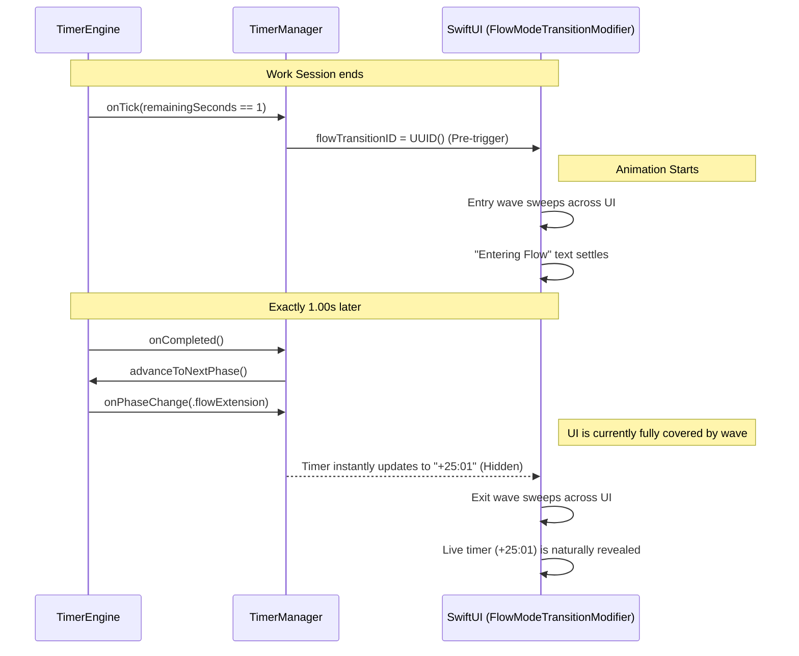

# Flow Transition Architecture

This document explains the architecture behind the visual transition from a Work session into Flow Extension mode. It specifically addresses why the animation is triggered *before* the session naturally completes, rather than after.

## The Architectural Philosophy

In FlowTimer, the `TimerEngine` owns the time and state, the `TimerManager` makes business-logic decisions based on that time, and the SwiftUI layer owns the presentation.

The goal for the transition into Flow mode was for the UI animation to act as the visual handoff. We want the user to perceive one seamless, deliberate transition rather than seeing the timer abruptly change its state (e.g., from `00:00` to `+25:00`) before the animation has a chance to hide it.

### Why Trigger at `remainingSeconds == 1`?

If we trigger the animation *after* the phase changes to `.flowExtension` (i.e. when `TimerEngine` reaches `00:00` and `onCompleted` fires), the underlying state has already become visible. The timer text will flash the new overtime value `+25:01` before the animation can cover it. 

To solve this, we intercept the final tick of the Work session:
- The `TimerManager` listens to the `onTick` callback.
- Exactly 1.00s before the session finishes (`remainingSeconds == 1`), the manager fires the `flowTransitionID` trigger.
- The UI begins its sweeping transition wave immediately.
- By the time the `TimerEngine` naturally reaches `0` and switches the phase to `.flowExtension`, the timer UI is completely submerged under the solid blue transition wave.
- The timer updates to `+25:01` secretly, underneath the wave, and is elegantly revealed when the exit wave sweeps away.

### Why `TimerEngine` Remains Unaware

This architecture keeps the separation of concerns pristine. 
- The `TimerEngine` just counts down and fires callbacks. It has no concept of "animations", "transitions", or "delays". 
- There is no need to manually pause or delay the engine to accommodate the UI.

### Why We Removed the `frozenTimeFormatted` Workaround

Before adopting the pre-trigger architecture, the application used a `frozenTimeFormatted` string in `TimerManager` to temporarily fake the UI state (locking it to `"00:00"`) while the animation ran. 

This approach was fragile and coupled the business layer to the presentation layer's animation duration. By starting the animation while the timer is still in `.work`, the UI is naturally covered when the state changes. The UI can now blindly observe the live `TimerManager.remainingTimeFormatted` value with zero interception, fake values, or manual synchronization. 

## Event Sequence

